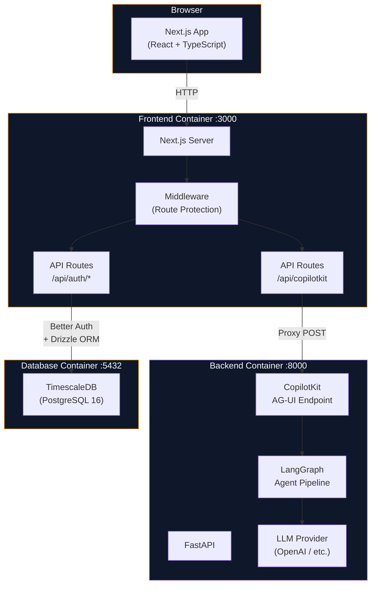

# Proteus Project

## Project Overview

A production-ready full-stack project for building AI-powered applications. Provides a pre-wired integration between a Next.js frontend and a FastAPI backend, with self-hosted authentication (Better Auth + Drizzle ORM), an agentic AI pipeline (LangGraph + CopilotKit), and a TimescaleDB database -- all containerized with Docker Compose for reproducible local development and straightforward deployment.

## Project-Specific Rules

> General coding style, testing, security, and git workflow rules are defined in `~/.claude/rules/`.
> Only project-specific overrides and additions belong here.

- Organize by **feature/domain**, not by type (e.g., `components/auth/`, `agent/`, not `components/`, `utils/`)
- Frontend validation uses **Zod** schemas; backend validation uses **Pydantic** models
- Auth logic lives exclusively in the **frontend** (Next.js API routes + Drizzle); the backend handles **AI/ML only**
- All CopilotKit traffic flows through the Next.js `/api/copilotkit` proxy -- the FastAPI backend is never exposed directly to the browser

---

## Project Structure

```
proteus/
├── .env.example                    # All required environment variables
├── docker-compose.yml              # Three-service orchestration
├── scripts/
│   └── init-db.sql                 # TimescaleDB extension init
│
├── frontend/                       # Next.js (App Router)
│   ├── Dockerfile
│   ├── drizzle.config.ts
│   ├── vitest.config.ts
│   ├── src/
│   │   ├── app/                    # Pages and API routes
│   │   │   ├── (auth)/             # Sign-in, sign-up pages
│   │   │   ├── dashboard/          # Authenticated dashboard
│   │   │   ├── chat/               # CopilotKit chat page
│   │   │   └── api/                # Auth + CopilotKit proxy routes
│   │   ├── components/             # UI components by domain
│   │   ├── db/schema/              # Drizzle schema (auth tables)
│   │   ├── hooks/                  # Custom React hooks
│   │   └── lib/                    # Auth, DB, and utility modules
│   └── __tests__/
│
├── backend/                        # FastAPI (Python)
│   ├── Dockerfile
│   ├── pyproject.toml
│   ├── src/
│   │   ├── main.py                 # App entry point + CopilotKit endpoint
│   │   ├── config.py               # Pydantic Settings
│   │   ├── agent/                  # LangGraph pipeline
│   │   └── api/                    # REST endpoints
│   └── tests/
```

---

## Design System

The UI is a **cool, professional analytical aesthetic** — clean surfaces, layered depth, and confident use of color to separate analysis from insight. The visual identity uses a dual-color system: **blue for analysis/intelligence** and **amber for insight/action**.

The overall feel is premium fintech — closer to Stripe or Linear than a basic dashboard. Surfaces use soft depth (layered shadows, elevated cards) with selective frosted glass accents on overlays and secondary panels.

---

### Theme Architecture

Theme variables live in `frontend/src/globals.css` as OKLCH CSS custom properties. ShadCN components consume them via `--primary`, `--secondary`, etc. Raw Tailwind color classes (`blue-*`, `amber-*`, `slate-*`) are used directly for charts, gradients, and decorative elements.

```
globals.css (oklch vars)
    └── @theme inline → Tailwind color tokens (color-primary, color-secondary, …)
        └── ShadCN components (Button variant="default" → bg-primary, etc.)
```

**Two separate color systems are used intentionally:**
- **ShadCN theme vars** (`bg-primary`, `text-secondary-foreground`) — for interactive UI components (Button, Input, Card)
- **Raw Tailwind classes** (`bg-blue-600`, `text-amber-500`) — for charts, data highlights, status indicators, and decorative accents

---

### Color Palette

#### Light Surfaces (default background system)

| Role | Class | Hex |
|------|-------|-----|
| Page background | `bg-slate-50` | `#F8FAFC` |
| Card / panel | `bg-white` | `#FFFFFF` |
| Elevated card | `bg-white shadow-sm` | `#FFFFFF` |
| Recessed / input | `bg-slate-50` or `bg-slate-100` | `#F8FAFC` / `#F1F5F9` |
| Default border | `border-slate-200` | `#E2E8F0` |
| Subtle border | `border-slate-100` | `#F1F5F9` |
| Active border | `border-blue-200` | `#BFDBFE` |
| Divider | `border-slate-200` | `#E2E8F0` |

#### Text

| Role | Class | Hex |
|------|-------|-----|
| Primary text | `text-slate-900` | `#0F172A` |
| Secondary text | `text-slate-600` | `#475569` |
| Muted / meta | `text-slate-400` | `#94A3B8` |
| Placeholder | `text-slate-300` | `#CBD5E1` |
| Inverse (on dark) | `text-white` | `#FFFFFF` |

#### Blue — Analysis, Intelligence, The Query

| Use | Class |
|-----|-------|
| Primary CTA button | `bg-blue-600 hover:bg-blue-700` |
| Navigation active state | `text-blue-600 border-blue-600` |
| Links | `text-blue-600 hover:text-blue-700` |
| Selected / active filter | `bg-blue-50 border-blue-200 text-blue-700` |
| Chart primary series | `stroke-blue-500` / `fill-blue-500` |
| Chart axes and gridlines | `stroke-slate-200` / `text-slate-400` |
| Icon accent | `text-blue-500` |
| Focus ring | `ring-blue-500/20` |
| Badge (informational) | `bg-blue-50 border-blue-200 text-blue-700` |
| Tooltip background | `bg-slate-900 text-white` |

#### Amber — Insight, Action, The Answer

| Use | Class |
|-----|-------|
| Key metric highlight | `text-amber-600` |
| Important finding indicator | `bg-amber-50 border-amber-200` |
| Chart highlight / callout | `stroke-amber-500` / `fill-amber-500` |
| Active toggle | `bg-amber-500` |
| Secondary CTA | `bg-amber-500 hover:bg-amber-600 text-white` |
| Status: positive trend | `text-amber-600` |
| Badge (actionable) | `bg-amber-50 border-amber-200 text-amber-700` |
| Star / bookmark | `text-amber-500` |
| Notification dot | `bg-amber-500` |

#### Semantic Colors

| Role | Class |
|-----|-------|
| Success / positive | `text-emerald-600` / `bg-emerald-50` |
| Warning / caution | `text-amber-600` / `bg-amber-50` |
| Error / negative | `text-red-600` / `bg-red-50` |
| Neutral change | `text-slate-500` |

---

### Typography

| Usage | Classes | Notes |
|-------|---------|-------|
| Page title | `text-2xl font-semibold tracking-tight text-slate-900` | Used sparingly, one per view |
| Section heading | `text-lg font-semibold text-slate-900` | Card titles, panel headers |
| Subsection | `text-sm font-medium text-slate-700` | Filter group labels, column headers |
| Body copy | `text-sm text-slate-600 leading-relaxed` | Descriptions, explanations |
| Chat message | `text-sm text-slate-900 leading-relaxed` | User and system messages |
| Data value (large) | `text-2xl font-semibold tabular-nums text-slate-900` | Key metrics, hero numbers |
| Data value (inline) | `text-sm font-medium tabular-nums text-slate-900` | Table cells, chart labels |
| Label / meta | `text-xs font-medium uppercase tracking-wide text-slate-400` | Timestamps, status indicators |
| Code / technical | `font-mono text-xs text-slate-600` | SQL preview, API parameters, observability panel |

Fonts are configured in `globals.css`:
- `--font-sans`: Inter (headings, body, data)
- `--font-mono`: JetBrains Mono (code, observability panel, technical detail)

---

### Surface Treatment

#### Soft Depth (default for all cards and panels)
```tsx
{/* Standard card */}
<div className="bg-white rounded-xl border border-slate-200 shadow-sm">

{/* Elevated card (interactive, hover states) */}
<div className="bg-white rounded-xl border border-slate-200 shadow-sm hover:shadow-md transition-shadow">

{/* Layered panel (sidebar, settings) */}
<div className="bg-white rounded-xl border border-slate-200 shadow-md">
```

#### Frosted Glass (selective — overlays and secondary panels only)
```tsx
{/* Observability panel */}
<div className="bg-white/80 backdrop-blur-xl rounded-xl border border-slate-200/60 shadow-lg">

{/* Modal overlay backdrop */}
<div className="bg-slate-900/20 backdrop-blur-sm">

{/* Floating tooltip / popover */}
<div className="bg-white/90 backdrop-blur-lg rounded-lg border border-slate-200/60 shadow-lg">
```

**Rules:**
- Frosted glass is used ONLY for elements that float above the main content layer: modals, popovers, the observability panel, and command palette
- All primary content surfaces use solid backgrounds with soft shadows
- Never use frosted glass for cards, tables, or chat messages

---

### Key Patterns

#### Chat Message (User)
```tsx
<div className="flex justify-end">
  <div className="bg-blue-600 text-white rounded-2xl rounded-br-md px-4 py-2.5 max-w-[80%] text-sm leading-relaxed">
    What was Chipotle's market share in Texas last quarter?
  </div>
</div>
```

#### Chat Message (System — with visualization)
```tsx
<div className="flex justify-start">
  <div className="bg-white rounded-2xl rounded-bl-md border border-slate-200 shadow-sm px-4 py-3 max-w-[90%] space-y-3">
    <p className="text-sm text-slate-900 leading-relaxed">
      Chipotle held 12.4% market share in Texas QSR during Q3...
    </p>
    {/* ECharts container */}
    <div className="rounded-lg border border-slate-100 bg-slate-50 p-3">
      <div id="chart" className="h-64 w-full" />
    </div>
  </div>
</div>
```

#### Metric Card
```tsx
<div className="bg-white rounded-xl border border-slate-200 shadow-sm p-5 space-y-1">
  <p className="text-xs font-medium uppercase tracking-wide text-slate-400">Market Share</p>
  <p className="text-2xl font-semibold tabular-nums text-slate-900">12.4%</p>
  <p className="text-xs font-medium text-emerald-600">+1.2% vs. prior quarter</p>
</div>
```

#### Filter / Dimension Chip (active)
```tsx
<span className="inline-flex items-center gap-1.5 px-3 py-1 rounded-full bg-blue-50 border border-blue-200 text-blue-700 text-xs font-medium">
  Texas
  <button className="text-blue-400 hover:text-blue-600">×</button>
</span>
```

#### Filter / Dimension Chip (inactive)
```tsx
<span className="inline-flex items-center gap-1.5 px-3 py-1 rounded-full bg-slate-100 border border-slate-200 text-slate-600 text-xs font-medium cursor-pointer hover:bg-slate-200 transition-colors">
  Geography
</span>
```

#### Observability Panel (frosted glass)
```tsx
<div className="bg-white/80 backdrop-blur-xl rounded-xl border border-slate-200/60 shadow-lg p-4 space-y-3 font-mono text-xs">
  <div className="flex items-center justify-between">
    <span className="text-xs font-medium uppercase tracking-wide text-slate-400">Pipeline</span>
    <span className="text-emerald-600">completed in 2.3s</span>
  </div>
  <div className="space-y-1.5">
    <p className="text-slate-500">Tool selected: <span className="text-slate-900">market_share_comparison</span></p>
    <p className="text-slate-500">Dimensions: <span className="text-slate-900">brand=Chipotle, geo=TX, period=Q3</span></p>
  </div>
</div>
```

#### Data Table
```tsx
<div className="bg-white rounded-xl border border-slate-200 shadow-sm overflow-hidden">
  <table className="w-full text-sm">
    <thead>
      <tr className="border-b border-slate-200 bg-slate-50">
        <th className="text-left px-4 py-2.5 text-xs font-medium uppercase tracking-wide text-slate-400">Brand</th>
        <th className="text-right px-4 py-2.5 text-xs font-medium uppercase tracking-wide text-slate-400">Market Share</th>
      </tr>
    </thead>
    <tbody className="divide-y divide-slate-100">
      <tr className="hover:bg-slate-50 transition-colors">
        <td className="px-4 py-2.5 font-medium text-slate-900">Chipotle</td>
        <td className="px-4 py-2.5 text-right tabular-nums text-slate-700">12.4%</td>
      </tr>
    </tbody>
  </table>
</div>
```

#### ShadCN Button — when to use
Use ShadCN `Button` for standard interactive elements: form submissions, navigation (paired with `asChild` + Next.js `Link`), and dialog actions. Use native `<button>` with raw Tailwind for chart controls, filter chips, and custom-styled elements that don't fit ShadCN's variant system.

---

### Chart Guidelines (ECharts)

#### Color Sequence for Multi-Series Charts
1. `#2563EB` (blue-600) — primary series
2. `#F59E0B` (amber-500) — secondary / comparison
3. `#10B981` (emerald-500) — tertiary
4. `#8B5CF6` (violet-500) — quaternary
5. `#EC4899` (pink-500) — fifth
6. `#6366F1` (indigo-500) — sixth

#### Chart Styling Defaults
- Background: transparent (inherits card background)
- Grid lines: `#E2E8F0` (slate-200), dashed
- Axis labels: `#94A3B8` (slate-400), 11px Inter
- Axis lines: `#CBD5E1` (slate-300)
- Tooltip: `#0F172A` background, white text, rounded-lg, subtle shadow
- Legend: below chart, `#475569` (slate-600) text, 12px Inter

#### Chart Container
Always wrap ECharts instances in a consistent container:
```tsx
<div className="rounded-lg border border-slate-100 bg-slate-50 p-3">
  <div id="chart" className="h-64 w-full" />
</div>
```

---

### Changing the Theme

The primary and secondary hue pair is defined once in `frontend/src/globals.css`:

```css
:root {
  --primary: oklch(0.55 0.2 230);   /* hue 230 = blue */
  --secondary: oklch(0.75 0.18 55); /* hue 55 = amber */
}
```

**To swap the accent color pair**, change the hue values (third parameter in `oklch`):

| Color | Hue |
|-------|-----|
| Amber / Gold | `55` |
| Orange | `35` |
| Green / Emerald | `145` |
| Teal / Cyan | `195` |
| Blue | `230` |
| Violet / Purple | `290` |
| Pink / Rose | `350` |

After changing the CSS vars, also update any **hardcoded raw Tailwind classes** in the page components — search for `blue-` and `amber-` and replace with the corresponding Tailwind color scale for your new hues. Chart color sequences, filter chips, badges, and chat bubbles all use raw classes and must be updated manually.

---

## Tech Stack

#### Architecture Diagram



#### Frontend (`frontend/`)

| Layer | Technology | Purpose |
|-------|-----------|---------|
| Framework | **Next.js** (App Router) | Server-side rendering, API routes, middleware |
| Language | **TypeScript** | Type safety across the entire frontend |
| UI Components | **Shadcn/ui** + **Tailwind CSS** | Accessible, composable component library with utility-first styling |
| Icons | **Lucide-React** | Consistent, tree-shakeable icon set |
| Forms | **React Hook Form** + **Zod** | Performant form state management with schema-based validation |
| Authentication | **Better Auth** (self-hosted) | Email/password auth running in Next.js API routes |
| ORM | **Drizzle ORM** | Type-safe database access for auth schema |
| AI Interface | **CopilotKit** (React SDK) | Pre-built chat UI and frontend AI integration |
| Testing | **Vitest** + **Testing Library** | Unit and component testing |
| Package Manager | **pnpm** | Fast, disk-efficient dependency management |

#### Backend (`backend/`)

| Layer | Technology | Purpose |
|-------|-----------|---------|
| Framework | **FastAPI** | High-performance async Python API server |
| AI Orchestration | **LangGraph** | Stateful, graph-based agentic workflows |
| AI Integration | **CopilotKit** (Python SDK) | Exposes LangGraph agents to the frontend via CopilotKit protocol |
| LLM Access | **LangChain** + **OpenAI** | Unified interface to LLM providers |
| Configuration | **Pydantic Settings** | Type-safe environment variable management |
| Testing | **Pytest** | Unit and integration testing |
| Package Manager | **uv** | Fast Python dependency management and virtual environments |

#### Infrastructure

| Component | Technology | Purpose |
|-----------|-----------|---------|
| Database | **TimescaleDB** (PostgreSQL 16) | Relational storage with time-series extensions |
| Containerization | **Docker Compose** | Three-service orchestration (frontend, backend, db) |
| Dev Workflow | Hot-reload mounts | Source directories mounted into containers for live reloading |

---

## Integration Gotchas

#### CopilotKit + LangGraph (AG-UI Protocol)

- **Backend endpoint:** Use `add_langgraph_fastapi_endpoint` from `ag_ui_langgraph`, NOT `add_fastapi_endpoint` from `copilotkit.integrations.fastapi` -- the old function calls `dict_repr()` which doesn't exist on `LangGraphAGUIAgent`
- **Backend checkpointer:** `LangGraphAGUIAgent` requires a checkpointer on the compiled graph (use `MemorySaver()` for dev) -- its `run()` method calls `aget_state` which fails without one
- **Frontend route:** The `/api/copilotkit` route must use `CopilotRuntime` + `HttpAgent` from `@copilotkit/runtime` and `@ag-ui/client`, NOT a raw `fetch` proxy
- **Agent name consistency:** The agent key in `CopilotRuntime({ agents: { chat_agent } })` must match the `name` in `LangGraphAGUIAgent(name="chat_agent")` and the `<CopilotKit agent="chat_agent">` prop

#### Environment Variables

- `dotenv.load_dotenv()` MUST be the first call in `backend/src/main.py`, BEFORE any LangChain/OpenAI imports -- `ChatOpenAI` reads `OPENAI_API_KEY` at import time
- The `.env` file lives at the project root; `frontend/.env` and `backend/.env` are symlinks to it
- `drizzle.config.ts` needs `import "dotenv/config"` at the top to load env vars