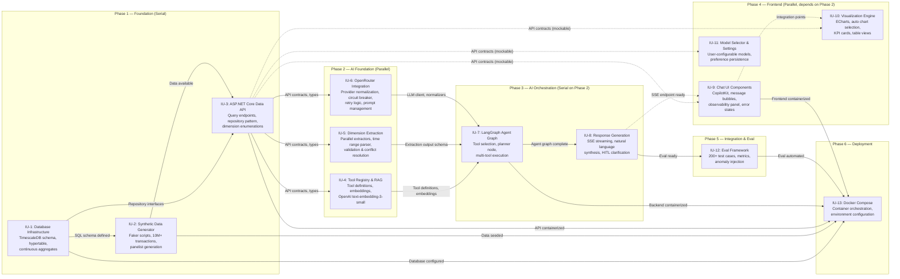

# Implementation Plan: Proteus

## Implementation Units Overview

| IU | Name | Description | FRs | Priority | Complexity | Dependencies |
|----|------|-------------|-----|----------|------------|-------------|
| 1 | Database Infrastructure | TimescaleDB schema, hypertable, continuous aggregates | FR-6.1-6.10 | P0 | High | — |
| 2 | Synthetic Data Generator | Faker scripts for panelists and transactions | FR-6.1-6.10 | P0 | High | IU-1 |
| 3 | ASP.NET Core Data API | Query endpoints, repository pattern, dimension enumerations | FR-4.1-4.7 | P0 | High | IU-1 |
| 4 | Tool Registry & RAG | Tool definitions, embeddings, retrieval interface | FR-2.1-2.3 | P1 | Medium | IU-3 |
| 5 | Dimension Extraction Pipeline | Parallel extractors, time range parsing, validation | FR-3.1-3.7 | P1 | Medium | IU-3, IU-6 |
| 6 | OpenRouter Integration | Provider normalization, circuit breaker, retry logic | FR-8.1-8.7 | P1 | Medium | IU-3 |
| 7 | LangGraph Agent Graph | Tool selection, planner node, state management | FR-2.4-2.6 | P2 | High | IU-4, IU-5, IU-6 |
| 8 | Response Generation & Streaming | SSE streaming, natural language synthesis | FR-1.2, FR-8.3 | P2 | Medium | IU-7 |
| 9 | Chat UI Components | CopilotKit integration, message handling, observability | FR-1.1, FR-1.3-1.8 | P3 | Medium | IU-3*, IU-8* |
| 10 | Visualization Engine | ECharts integration, auto chart selection, KPI cards | FR-5.1-5.9 | P3 | Medium | IU-3* |
| 11 | Model Selector & Settings | User-configurable model selection, settings persistence | FR-1.5, FR-8.3 | P3 | Low | IU-8, IU-9 |
| 12 | Eval Framework | 200+ test cases, metrics collection, anomaly injection | FR-7.1-7.6 | P4 | Medium | IU-1, IU-7, IU-8 |
| 13 | Docker Compose & DevOps | Container orchestration, environment configuration | NFR-2.1-2.5 | P0 | Low | All others |

* Soft dependencies — can develop against mocks/stubs in parallel.

---

## Dependency Graph



**Legend:**
- Solid arrows (`-->`) indicate **hard dependencies** (must complete before downstream starts)
- Dashed arrows (`.->`) indicate **soft dependencies** (can develop against mocks/stubs in parallel)
- Critical path is highlighted in Phase 1 and Phase 3

---

## Unit Definitions

### Unit 1: Database Infrastructure

**Scope:** Design and implement TimescaleDB schema with hypertable configuration, dimension tables, continuous aggregates, and indexes for the synthetic transaction dataset.

**Owns (files/directories):**
- `scripts/init-db.sql` — Full database schema, hypertable creation, continuous aggregates
- `api/scripts/init-timescale.sql` — TimescaleDB-specific setup
- `api/scripts/continuous-aggregates.sql` — Materialized views for daily/weekly/monthly rollups
- `api/scripts/compression-policy.sql` — Compression and retention policies

**FR Coverage:** FR-6.1-6.10 (all synthetic data layer requirements)

**Dependencies:** None (foundation layer)

**Interface Contract — Exports:**
```sql
-- Key tables accessible to API:
- brands(id, name, tier, archetype, parent_company_id)
- categories(id, level1, level2, level3)
- geography(id, state_code, state_name, cbsa_code, cbsa_name, urban_class, zip3)
- generations(id, name, birth_year_start, birth_year_end)
- income_bands(id, name, min_income, max_income)
- panelists(id, income_band_id, generation_id, geography_id, panel_start_date, panel_weight)
- transactions(id, transaction_timestamp, panelist_id, brand_id, category_id, geography_id, generation_id, income_band_id, transaction_amount, card_type, payment_network, channel, day_of_week, hour_of_day, tenant_id)

-- Continuous aggregates:
- transactions_daily
- transactions_weekly
- transactions_monthly
- market_share_daily
```

**Interface Contract — Imports:** None

**Requirements:** [See FR-6.1 through FR-6.10 for complete specification including data volume, statistical distributions, seasonal patterns, and validation benchmarks]

---

### Unit 2: Synthetic Data Generator

**Scope:** Implement Python Faker-based scripts to generate 10M+ synthetic transactions with realistic statistical properties, embedded seasonal patterns, and demographic correlations.

**Owns (files/directories):**
- `backend/src/data/generate_synthetic_data.py` — Main generation orchestrator
- `backend/src/data/panelist_generator.py` — Panelist (100K-500K) generation
- `backend/src/data/transaction_generator.py` — Transaction generation with log-normal amounts
- `backend/src/data/distributions.py` — Statistical distribution helpers
- `backend/src/data/seasonal_patterns.py` — Q4 spike, back-to-school, weekend patterns
- `backend/src/data/validation.py` — Statistical validation tests

**FR Coverage:** FR-6.6-6.10 (statistical distributions, embedded patterns, panel data)

**Dependencies:**
- IU-1 (Database Infrastructure) — Must have schema available for data insertion

**Interface Contract — Exports:**
```python
class SyntheticDataGenerator:
    DEFAULT_SEED = 42  # For reproducibility

    def generate_panelists(self, count: int, seed: int = DEFAULT_SEED) -> List[Panelist]
    def generate_transactions(self, panelists: List[Panelist], start_date: date, end_date: date) -> Generator[Transaction, None, None]
    def validate_distribution(self, transactions: List[Transaction]) -> ValidationReport
```

**Interface Contract — Imports:**
- PostgreSQL connection via `DATABASE_URL` environment variable

**Requirements:** [See FR-6.6 through FR-6.10 for complete specification including log-normal parameters, income multipliers, holiday spikes, generational preferences, and quality metrics]

---

### Unit 3: ASP.NET Core Data API

**Scope:** Implement REST API with query endpoints, repository pattern, query guardrails, dimension enumeration caching, and comprehensive error handling.

**Owns (files/directories):**
- `api/Models/QueryModels.cs` — QueryRequest, QueryResponse, Dimensions, AggregationConfig, PaginationConfig
- `api/Models/ErrorResponse.cs` — ErrorResponse with request_id, error codes
- `api/Endpoints/QueryEndpoint.cs` — POST /api/query endpoint
- `api/Endpoints/BatchQueryEndpoint.cs` — POST /api/query/batch for multi-tool
- `api/Endpoints/DimensionEndpoints.cs` — GET /api/dimensions/{dimension}
- `api/Repositories/IQueryRepository.cs` — Repository interface
- `api/Repositories/TimescaleQueryRepository.cs` — TimescaleDB implementation
- `api/Validators/QueryGuardrails.cs` — High-cardinality filter validation
- `api/Services/AggregationLevelResolver.cs` — Auto-aggregation logic per FR-3.3
- `api/Middleware/ErrorHandlingMiddleware.cs` — Request_id injection, error response formatting

**FR Coverage:** FR-4.1-4.7 (API contract, batch queries, guardrails, aggregation, repository pattern, dimension enumerations, error structure)

**Dependencies:**
- IU-1 (Database Infrastructure) — Requires database schema

**Interface Contract — Exports:**
```csharp
// POST /api/query
public class QueryRequest {
    public string Tool { get; set; }
    public Dimensions Dimensions { get; set; }
    public AggregationConfig Aggregation { get; set; }
    public PaginationConfig Pagination { get; set; }
}

public class QueryResponse {
    public List<Dictionary<string, object>> Data { get; set; }
    public QueryMetadata Metadata { get; set; }
}

// POST /api/query/batch
public class BatchQueryRequest {
    public List<QueryRequest> Queries { get; set; }
}

public class BatchQueryResponse {
    public Dictionary<string, QueryResponse> Results { get; set; }
    public Dictionary<string, long> LatencyPerQuery { get; set; }
    public long TotalExecutionTimeMs { get; set; }
    public string? SynthesizedSummary { get; set; }
}

// GET /api/dimensions/{dimension}
public class DimensionValue {
    public string Id { get; set; }
    public string CanonicalName { get; set; }
    public List<string> Aliases { get; set; }
}
```

**Interface Contract — Imports:**
- PostgreSQL via Npgsql (TimescaleDB)
- Dimension enumeration files from `api/config/dimensions/*.yaml`

**Requirements:** [See FR-4.1 through FR-4.7 for complete API contract, error codes, guardrail rules, and aggregation logic]

---

### Unit 4: Tool Registry & RAG Retrieval

**Scope:** Implement tool registry with 12-15 tool definitions, OpenAI text-embedding-3-small embeddings via OpenRouter, and semantic retrieval interface.

**Owns (files/directories):**
- `backend/src/api/models/tool.py` — ToolDefinition, ToolParameter, ToolOutputSchema Pydantic models
- `backend/src/agent/registry.py` — ToolRegistry class with register, get, list_active, search_by_embedding
- `backend/src/api/openrouter.py` — OpenRouterClient for embeddings
- `backend/src/agent/retrieval.py` — ToolRetriever abstract class, EmbeddingRetriever implementation
- `backend/src/config/tools/*.yaml` — Tool definition YAML files (market_share_trend.yaml, brand_comparison.yaml, etc.)

**FR Coverage:** FR-2.1-2.3 (tool registry, core tool set, RAG-based retrieval)

**Dependencies:**
- IU-3 (ASP.NET Core Data API) — Requires API contracts/types defined

**Interface Contract — Exports:**
```python
class ToolDefinition(BaseModel):
    id: str
    name: str
    description: str
    capabilities: List[str]
    required_dimensions: List[str]
    optional_dimensions: List[str]
    parameters: List[ToolParameter]
    output_schema: ToolOutputSchema
    example_queries: List[str]
    aliases: List[str]
    version: str

class RetrievedTool(BaseModel):
    tool_id: str
    tool_definition: ToolDefinition
    similarity: float
    rank: int

class ToolRetriever(ABC):
    def retrieve(
        self,
        query: str,
        query_embedding: np.ndarray,
        top_k: int = 8,
        similarity_threshold: float = 0.70
    ) -> List[RetrievedTool]
```

**Interface Contract — Imports:**
- OpenRouter API key via environment variable
- Tool definition YAML files

**Mock Strategy:** During parallel development, downstream units can use mock tool definitions with pre-computed embeddings stored in `backend/src/config/tools/mock_embeddings.json`.

**Requirements:** [See FR-2.1 through FR-2.3 for tool definitions, priority order (P0/P1/P2), RAG retrieval thresholds, and embedding model specification]

---

### Unit 5: Dimension Extraction Pipeline

**Scope:** Implement parallel dimension extraction nodes for brand, geography, time_range, category, generation, income_band, card_type, payment_network, channel, day_of_week with validation and conflict resolution.

**Owns (files/directories):**
- `backend/src/api/models/dimensions.py` — ExtractedDimensions, DimensionValidationResult, Generation, IncomeBand Pydantic models
- `backend/src/agent/nodes.py` — DimensionExtractor abstract class, BrandExtractor, TimeRangeExtractor, GeographyExtractor, CategoryExtractor, GenerationExtractor, IncomeBandExtractor implementations
- `backend/src/agent/graph.py` — DimensionExtractionGraph with parallel execution
- `backend/src/api/lookup.py` — SynonymResolver with fuzzy matching, brand alias lookup
- `backend/src/agent/validation.py` — LLMExtractionValidator, conflict detection

**FR Coverage:** FR-3.1-3.7 (dimension categories, parallel extraction, time range parsing, synonym handling, validation, conflict resolution)

**Dependencies:**
- IU-3 (ASP.NET Core Data API) — For dimension enumeration endpoints during validation
- IU-6 (OpenRouter Integration) — For LLM calls in extractors

**Interface Contract — Exports:**
```python
class DimensionExtractionInput(BaseModel):
    query: str
    conversation_history: List[Dict[str, Any]]
    dimension_type: str
    max_tokens: int = 2000

class DimensionExtractionResult(BaseModel):
    dimension_type: str
    values: List[Any]
    confidence: float
    alternatives: List[Dict[str, Any]]
    extraction_method: str  # "llm" | "deterministic" | "lookup"
    latency_ms: int
    validation_status: str

class ExtractedDimensions(BaseModel):
    brand: List[str] = []
    merchant_category: List[str] = []
    geography: List[str] = []
    time_range: Optional[Dict[str, Any]] = None
    generation: List[str] = []
    income_band: List[str] = []
    card_type: List[str] = []
    payment_network: List[str] = []
    channel: List[str] = []
    day_of_week: List[str] = []
    aggregation_level: Optional[str] = None
```

**Interface Contract — Imports:**
- OpenRouter LLM client from IU-6
- Dimension enumeration cached data from IU-3

**Requirements:** [See FR-3.1 through FR-3.7 for complete dimension categories, extraction latency targets, parallel execution architecture, time range parsing rules, and validation schema]

---

### Unit 6: OpenRouter Integration

**Scope:** Implement OpenRouter client with provider normalization, circuit breaker pattern, exponential backoff retry, and prompt versioning.

**Owns (files/directories):**
- `backend/src/api/openrouter.py` — OpenRouterClient with call_with_retry
- `backend/src/api/normalizers.py` — ProviderResponseNormalizer registry (OpenAI, Anthropic, Google, Kimi, MiniMax, GLM)
- `backend/src/api/circuit_breaker.py` — CircuitBreaker, CircuitState, CriticalPathFallback
- `backend/src/agent/prompts.py` — PromptManager, PromptVersion, prompt templates
- `backend/src/config.py` — ModelConfig with internal and user-configurable model settings

**FR Coverage:** FR-8.1-8.7 (OpenRouter integration, model configuration, provider normalization, retry logic, prompt management)

**Dependencies:**
- IU-3 (ASP.NET Core Data API) — For API type definitions

**Interface Contract — Exports:**
```python
class OpenRouterClient:
    MAX_RETRIES = 3
    RETRY_DELAY_BASE = 1.0

    def call_with_retry(
        self,
        model: str,
        messages: List[Dict],
        temperature: float = 0.0,
        max_tokens: int = 2048
    ) -> Dict[str, Any]

    def embed_texts(self, texts: List[str], model: str = "openai/text-embedding-3-small") -> List[np.ndarray]

class NormalizerRegistry:
    @classmethod
    def get_normalizer(cls, provider: str) -> ProviderResponseNormalizer

INTERNAL_MODELS = {
    "tool_selection": "minimax/text-01",
    "dimension_extraction": "moonshot/kimi-k2",
    "planner": "google/gemini-2.0-flash",
    "embedding": "openai/text-embedding-3-small",
}
```

**Interface Contract — Imports:**
- OPENAI_API_KEY environment variable

**Requirements:** [See FR-8.1 through FR-8.7 for model configuration, provider normalization rules, circuit breaker thresholds, and fallback defaults]

---

### Unit 7: LangGraph Agent Graph

**Scope:** Implement the LangGraph-based agent with tool selection (MiniMax-Text-01), planner node for multi-tool queries (GLM-4-Air), HITL clarification handling, and state management.

**Owns (files/directories):**
- `backend/src/agent/state.py` — AgentState, SessionContext Pydantic models
- `backend/src/agent/graph.py` — AgentGraph class with tool_selection_node, planner_node, dimension_extraction_node, execution_node
- `backend/src/agent/nodes.py` — ToolSelectionResult, HITLClarification, ExecutionPlan, PlannedTool Pydantic models and node implementations
- `backend/src/agent/prompts.py` — PLANNER_PROMPT, TOOL_SELECTION_PROMPT, EXTRACTION_PROMPT

**FR Coverage:** FR-2.4-2.6 (tool selection LLM, HITL clarification, multi-tool planning)

**Dependencies:**
- IU-4 (Tool Registry & RAG) — For retrieved tools input
- IU-5 (Dimension Extraction) — For extraction results input
- IU-6 (OpenRouter Integration) — For LLM calls

**Interface Contract — Exports:**
```python
class ToolSelectionResult(BaseModel):
    selected_tools: List[str]
    confidence: float
    confidence_breakdown: Dict[str, float]
    competing_candidates: Optional[List[str]]
    reasoning: str

class HITLClarification(BaseModel):
    ambiguity_type: str
    message: str
    options: List[ClarificationOption]  # 2-3 max
    suggested_question: Optional[str]

class ExecutionPlan(BaseModel):
    plan_id: str
    is_multi_tool: bool
    tools: List[PlannedTool]
    dimension_dependencies: Dict[str, List[str]]
    estimated_latency_ms: int
    execution_mode: str  # "parallel" | "sequential"

async def run_agent_graph(query: str, session_id: str, conversation_history: List[Dict]) -> AgentOutput
```

**Interface Contract — Imports:**
- ToolRetriever from IU-4
- DimensionExtractionGraph from IU-5
- OpenRouterClient from IU-6

**Requirements:** [See FR-2.4 through FR-2.6 for tool selection confidence scoring, HITL thresholds, and multi-tool execution planning]

---

### Unit 8: Response Generation & Streaming

**Scope:** Implement SSE-based streaming for response generation with natural language synthesis, CopilotKit agent endpoint, and multi-turn conversation context management.

**Owns (files/directories):**
- `backend/src/api/router.py` — FastAPI router with /api/copilotkit endpoint
- `backend/src/agent/streaming.py` — SSE streaming handler
- `backend/src/agent/response.py` — Response synthesizer, natural language generation
- `backend/src/agent/context.py` — Session context management, token window, summarization

**FR Coverage:** FR-1.2 (multi-turn conversation), FR-8.3 (response generation model), NFR-1.4 (streaming)

**Dependencies:**
- IU-7 (LangGraph Agent Graph) — For agent execution results

**Interface Contract — Exports:**
```python
# SSE event types
class SSEToolResult:
    event: "tool_result"
    data: ToolResult

class SSEClarification:
    event: "clarification"
    data: HITLClarification

class SSEStreamChunk:
    event: "stream"
    data: str  # Token chunk

class SSEDone:
    event: "done"
    data: ObservabilityMetadata

# CopilotKit endpoint
POST /api/copilotkit
Request: { messages: List[ChatMessage], session_id: str, selected_model: str }
Response: SSE stream of SSEToolResult | SSEClarification | SSEStreamChunk | SSEDone
```

**Interface Contract — Imports:**
- AgentGraph from IU-7
- ModelConfig from IU-6

**Requirements:** [See FR-1.2 for multi-turn conversation requirements including token window management, session anchor preservation, and reference resolution; FR-8.3 for response generation model configuration]

---

### Unit 9: Chat UI Components

**Scope:** Implement CopilotKit ChatSidebar with message bubbles, observability panel (4-level progressive disclosure), loading/feedback states, error handling, and empty state.

**Owns (files/directories):**
- `frontend/src/components/chat/CopilotChat.tsx` — Main CopilotKit wrapper
- `frontend/src/components/chat/ChatSidebar.tsx` — Sidebar container (380-420px)
- `frontend/src/components/chat/ChatDrawer.tsx` — Mobile drawer with FAB
- `frontend/src/components/chat/MessageBubble.tsx` — Chat message with expand icon
- `frontend/src/components/chat/ClarificationCard.tsx` — HITL inline clarification
- `frontend/src/components/chat/EmptyState.tsx` — Initial placeholder
- `frontend/src/components/feedback/StageIndicator.tsx` — Pipeline stage display
- `frontend/src/components/feedback/ChartSkeleton.tsx` — Chart-shaped skeleton loader
- `frontend/src/components/feedback/ErrorMessage.tsx` — Error display with suggestions
- `frontend/src/hooks/use-conversation.ts` — Conversation state management
- `frontend/src/hooks/use-observability.ts` — Observability state (localStorage persistence)
- `frontend/src/hooks/use-sidebar.ts` — Mobile breakpoint handling

**FR Coverage:** FR-1.1, FR-1.3-1.8 (layout, observability panel, loading states, error handling, empty state)

**Dependencies:**
- IU-3 (ASP.NET Core Data API) — For API contracts (can use mock data)
- IU-8 (Response Generation) — For SSE streaming interface (can mock)

**Interface Contract — Exports:**
```typescript
interface ChatSidebarProps {
  width?: number;  // 380-420, default 400
  isCollapsed?: boolean;
}

interface ObservabilityState {
  level: 0 | 1 | 2 | 3;
  isEnabled: boolean;
}

interface ClarificationCardProps {
  originalQuery: string;
  ambiguity: string;
  options: ClarificationOption[];  // Max 3
  onSelect: (optionId: string) => void;
  onDismiss: () => void;
}
```

**Interface Contract — Imports:**
- CopilotKit from `@copilotkit/react-core`
- Backend SSE endpoint via `BACKEND_URL` environment variable

**Requirements:** [See FR-1.1 through FR-1.8 for complete UI specifications including layout dimensions, observability level behaviors, stage indicator timing, and error message formatting]

---

### Unit 10: Visualization Engine

**Scope:** Implement ECharts-based visualization with auto chart-type selection based on query pattern, KPI cards for single values, table views, chart interactivity (zoom, tooltips, legend), and thumbnail generation.

**Owns (files/directories):**
- `frontend/src/components/visualization/VisualizationCanvas.tsx` — Main canvas for charts/tables
- `frontend/src/components/visualization/ChartComponent.tsx` — ECharts wrapper
- `frontend/src/components/visualization/KPICard.tsx` — Single value display with comparisons
- `frontend/src/components/visualization/ChartToolbar.tsx` — Manual override dropdown
- `frontend/src/components/visualization/ViewModeToggle.tsx` — Chart/Table/Both toggle
- `frontend/src/components/visualization/EmptyChart.tsx` — No data state
- `frontend/src/lib/chart-selection.ts` — selectChartType decision matrix
- `frontend/src/lib/echarts-config.ts` — Base chart configurations
- `frontend/src/lib/result-set-handler.ts` — Pagination and aggregation logic
- `frontend/src/hooks/use-visualization-history.ts` — Thumbnail generation, history

**FR Coverage:** FR-5.1-5.9 (chart selection, KPI display, table toggle, interactivity, result set handling)

**Dependencies:**
- IU-3 (ASP.NET Core Data API) — For API contracts (can mock data)

**Interface Contract — Exports:**
```typescript
type ChartType = 'kpi' | 'line' | 'bar' | 'horizontal_bar' | 'pie' | 'donut' |
                  'stacked_bar' | 'scatter' | 'heatmap' | 'choropleth' |
                  'stacked_area' | 'waterfall' | 'bump' | 'table';

interface ChartSelectionInput {
  query: string;
  toolId: string;
  resultShape: {
    rowCount: number;
    hasTimeDimension: boolean;
    hasMultipleSeries: boolean;
    metricType: 'kpi' | 'time_series' | 'breakdown' | 'ranking';
  };
}

function selectChartType(input: ChartSelectionInput): { chartType: ChartType; confidence: number };
```

**Interface Contract — Imports:**
- ECharts via `echarts` npm package
- Query response types from shared API contract

**Requirements:** [See FR-5.1 through FR-5.9 for complete chart selection rules, KPI calculation formulas, interactivity specifications, and result set thresholds]

---

### Unit 11: Model Selector & Settings

**Scope:** Implement user-configurable model selection dropdown, settings persistence, and CopilotKit model passthrough.

**Owns (files/directories):**
- `frontend/src/components/settings/ModelSelector.tsx` — Dropdown with provider logos
- `frontend/src/components/providers/copilot-provider.tsx` — Updated CopilotKit provider with model config
- `frontend/src/app/api/copilotkit/route.ts` — Updated to pass selected model

**FR Coverage:** FR-1.5 (model selector), FR-8.3 (response generation model)

**Dependencies:**
- IU-8 (Response Generation) — For SSE endpoint interface
- IU-9 (Chat UI Components) — For CopilotKit integration

**Interface Contract — Exports:**
```typescript
interface ModelOption {
  id: string;  // e.g., "openai/gpt-4o"
  provider: 'openai' | 'google' | 'anthropic' | 'kimi' | 'minimax' | 'glm';
  displayName: string;
  logoUrl?: string;
  supportsFunctionCalling: boolean;
}

const RESPONSE_GENERATION_MODELS: ModelOption[] = [
  { id: 'openai/gpt-4o', provider: 'openai', displayName: 'GPT-4o', supportsFunctionCalling: true },
  { id: 'google/gemini-2.0-flash', provider: 'google', displayName: 'Gemini 2.0 Flash', supportsFunctionCalling: true },
  // ... etc
];
```

**Interface Contract — Imports:**
- Backend SSE endpoint with model parameter

**Requirements:** [See FR-1.5 for UI placement and display requirements; FR-8.3 for model configuration and fallback behavior]

---

### Unit 12: Eval Framework

**Scope:** Implement evaluation suite with 200+ test cases across 5 complexity levels, automated metrics collection, and anomaly injection for detection testing.

**Owns (files/directories):**
- `backend/src/eval/models.py` — TestFixture, EvalResult, EvalRun Pydantic models
- `backend/src/eval/runner.py` — EvalRunner class with automated execution
- `backend/src/eval/metrics.py` — Metric calculators for tool selection, dimension extraction, visualization
- `backend/src/eval/anomalies.py` — AnomalyTestCase definitions (seasonal, COVID-style, secular trends)
- `backend/src/eval/fixtures/*.json` — 200+ test case fixtures
- `backend/scripts/run-eval.py` — CLI for eval execution

**FR Coverage:** FR-7.1-7.6 (eval suite size, dimensions, rubric, test structure, anomaly injection)

**Dependencies:**
- IU-1 (Database Infrastructure) — For data queries during eval
- IU-7 (LangGraph Agent Graph) — For agent execution during eval
- IU-8 (Response Generation) — For streaming interface

**Interface Contract — Exports:**
```python
class TestFixture(BaseModel):
    id: str
    description: str
    natural_language_input: str
    expected_tools: List[str]
    expected_parameters: List[ExpectedParameter]
    expected_result_characteristics: Dict[str, Any]
    complexity_level: ComplexityLevel
    synonym_variations: List[str]
    category: str

class EvalResult(BaseModel):
    fixture_id: str
    trial_number: int
    temperature: float = 0.0
    actual_tools: List[str]
    actual_parameters: Dict[str, List[str]]
    tool_selection_correct: bool
    dimension_extraction_correct: bool
    visualization_correct: Optional[bool]
    end_to_end_correct: bool
    latency_ms: int
    error: Optional[str]

class EvalRun(BaseModel):
    run_id: str
    timestamp: datetime
    fixture_results: List[EvalResult]
    aggregate_metrics: Dict[str, float]
```

**Interface Contract — Imports:**
- AgentGraph from IU-7 for query execution
- Synthetic dataset for ground truth

**Requirements:** [See FR-7.1 through FR-7.6 for complete eval specifications including test case distribution, accuracy targets, rubric definitions, and anomaly test cases]

---

### Unit 13: Docker Compose & DevOps

**Scope:** Implement Docker Compose orchestration with health checks, environment configuration, volume management, and development workflow scripts.

**Owns (files/directories):**
- `docker-compose.yml` — Updated with all service definitions and dependencies
- `docker-compose.dev.yml` — Development overrides with volume mounts
- `Dockerfile` (backend) — Python FastAPI container
- `Dockerfile` (frontend) — Node/Next.js container
- `Dockerfile` (api) — ASP.NET Core container
- `scripts/start-all` — Full stack startup script
- `scripts/health-check` — Service health verification
- `.env.example` — Environment variable template

**FR Coverage:** NFR-2.1-2.5 (container architecture, network topology, technology stack, CopilotKit integration, multi-tenancy readiness)

**Dependencies:**
- All other IUs for container builds

**Interface Contract — Exports:**
```yaml
# Docker Compose services:
# - db (TimescaleDB)
# - backend (FastAPI AI Pipeline)
# - api (ASP.NET Core Data API)
# - frontend (Next.js)

# Network topology:
# Frontend -> HTTP /api/copilotkit -> Backend
# Backend -> HTTP /api/query -> API
# API -> PostgreSQL -> DB
```

**Interface Contract — Imports:** None (terminal unit)

**Requirements:** [See NFR-2.1 through NFR-2.5 for complete architecture specifications including container definitions, network topology, and multi-tenancy preparation]

---

## Interface Contracts Summary

### FastAPI to ASP.NET Core API Contract

```typescript
// Request from FastAPI to Data API
interface DataAPIQueryRequest {
  tool: string;
  dimensions: {
    brand?: string[];
    category?: string[];
    geo?: string;
    period?: { start: string; end: string; period_type?: string };
    generation?: string[];
    income_band?: string[];
    card_type?: string[];
    payment_network?: string[];
    channel?: string[];
    day_of_week?: string[];
  };
  aggregation: {
    level: string;  // hourly, daily, weekly, monthly, quarterly, annual, auto
    metric: string;  // sum, avg, count, min, max, median
  };
  pagination: {
    limit: number;
    cursor?: string;
  };
}

// Response from Data API to FastAPI
interface DataAPIQueryResponse {
  data: Array<Record<string, any>>;
  metadata: {
    tool: string;
    row_count: number;
    execution_time_ms: number;
    pagination: {
      next_cursor: string | null;
      has_more: boolean;
    };
    aggregation_level: string;
  };
}

// Batch variant
interface DataAPIBatchRequest {
  queries: DataAPIQueryRequest[];
}

interface DataAPIBatchResponse {
  results: Record<string, DataAPIQueryResponse>;
  latency_per_query: Record<string, number>;
  total_execution_time_ms: number;
  synthesized_summary?: string;
}

// Error response
interface DataAPIError {
  error: string;  // MISSING_REQUIRED_DIMENSION, INVALID_DIMENSION_VALUE, etc.
  message: string;
  request_id: string;
  suggestions?: string[];
  retry_after?: number;
}
```

### Python Dimension Extraction to FastAPI Contract

```python
class ExtractedDimensions(BaseModel):
    brand: List[str] = []
    merchant_category: List[str] = []
    geography: List[str] = []
    time_range: Optional[Dict[str, Any]] = None
    generation: List[str] = []
    income_band: List[str] = []
    card_type: List[str] = []
    payment_network: List[str] = []
    channel: List[str] = []
    day_of_week: List[str] = []
    aggregation_level: Optional[str] = None

class DimensionExtractionOutput(BaseModel):
    extracted_dimensions: ExtractedDimensions
    conflicts: List[DimensionConflict] = []
    validation_errors: List[str] = []
    retry_count: int = 0
    schema_version: str = "1.0"
```

### Tool Registry to RAG Retrieval Contract

```python
class RetrievedTool(BaseModel):
    tool_id: str
    tool_definition: ToolDefinition
    similarity: float
    rank: int

class ToolRetrievalResult(BaseModel):
    query: str
    retrieved_tools: List[RetrievedTool]
    retrieval_latency_ms: int
    embedding_model: str
```

### Frontend to FastAPI SSE Contract

```typescript
// SSE Events from Backend to Frontend
type SSEEvent =
  | { event: "tool_result"; data: ToolResult }
  | { event: "clarification"; data: ClarificationOption[] }
  | { event: "stream"; data: string }
  | { event: "done"; data: ObservabilityMetadata }
  | { event: "error"; data: ErrorDisplay };

interface ToolResult {
  referenceId: string;
  toolName: string;
  dimensions: Record<string, any>;
  data: any;
  timestamp: Date;
}

interface ObservabilityMetadata {
  requestId: string;
  pipelineStages: PipelineStageMetadata[];
  totalLatencyMs: number;
  modelUsed: string;
  promptVersion: string;
  ragCandidates?: Array<{ toolId: string; toolName: string; similarity: number }>;
}
```

---

## Suggested Implementation Order

### Phase 1: Foundation (Weeks 1-3) — Critical Path

**IU-1: Database Infrastructure** (Week 1)
- Design and implement TimescaleDB schema
- Create hypertable with daily chunk intervals
- Implement continuous aggregates (daily, weekly, monthly)
- Set up compression and retention policies

**IU-2: Synthetic Data Generator** (Week 2)
- Implement panelist generator (100K-500K panelists)
- Implement transaction generator with log-normal amounts
- Embed seasonal patterns (Q4 spike, back-to-school, weekend)
- Add statistical validation tests

**IU-3: ASP.NET Core Data API** (Week 3)
- Implement query endpoint with repository pattern
- Add batch endpoint for multi-tool queries
- Implement query guardrails
- Add dimension enumeration endpoints
- Set up error handling middleware

### Phase 2: AI Foundation (Weeks 4-6) — Parallel Development

**IU-4: Tool Registry & RAG** (Week 4)
- Define 12-15 tool YAML files
- Implement ToolRegistry with embeddings
- Set up OpenAI text-embedding-3-small integration

**IU-5: Dimension Extraction Pipeline** (Week 4-5)
- Implement parallel extractors for all dimension categories
- Add time range parsing with aggregation rules
- Implement validation and conflict resolution

**IU-6: OpenRouter Integration** (Week 5-6)
- Implement provider normalization for all 6 providers
- Add circuit breaker and retry logic
- Set up prompt versioning system

### Phase 3: AI Orchestration (Weeks 7-9) — Serial on Phase 2

**IU-7: LangGraph Agent Graph** (Week 7-8)
- Implement tool selection with confidence scoring
- Add planner node for multi-tool queries
- Implement HITL clarification flow

**IU-8: Response Generation & Streaming** (Week 8-9)
- Implement SSE streaming handler
- Add response synthesizer
- Implement multi-turn context management

### Phase 4: Frontend (Weeks 7-10) — Parallel with Phase 3

**IU-9: Chat UI Components** (Week 7-8)
- Implement CopilotKit ChatSidebar
- Add observability panel with 4-level disclosure
- Implement error handling and loading states

**IU-10: Visualization Engine** (Week 8-9)
- Implement ECharts integration
- Add auto chart-type selection
- Implement KPI cards and table views

**IU-11: Model Selector & Settings** (Week 9-10)
- Add model selection dropdown
- Implement settings persistence
- Connect to CopilotKit provider

### Phase 5: Eval & Integration (Weeks 10-12)

**IU-12: Eval Framework** (Week 10-11)
- Create 200+ test case fixtures
- Implement automated metric collection
- Add anomaly injection test cases

**IU-13: Docker Compose & DevOps** (Week 11-12)
- Set up complete Docker Compose stack
- Add health checks and monitoring
- Create development workflow scripts

---

## File Ownership Matrix

| File/Directory | Owner IU |
|----------------|----------|
| `scripts/init-db.sql` | IU-1 |
| `api/scripts/init-timescale.sql` | IU-1 |
| `api/scripts/continuous-aggregates.sql` | IU-1 |
| `backend/src/data/generate_synthetic_data.py` | IU-2 |
| `backend/src/data/panelist_generator.py` | IU-2 |
| `backend/src/data/transaction_generator.py` | IU-2 |
| `backend/src/data/distributions.py` | IU-2 |
| `backend/src/data/seasonal_patterns.py` | IU-2 |
| `backend/src/data/validation.py` | IU-2 |
| `api/Models/*.cs` | IU-3 |
| `api/Endpoints/*.cs` | IU-3 |
| `api/Repositories/*.cs` | IU-3 |
| `api/Validators/*.cs` | IU-3 |
| `api/Services/*.cs` | IU-3 |
| `api/Middleware/*.cs` | IU-3 |
| `backend/src/api/models/tool.py` | IU-4 |
| `backend/src/agent/registry.py` | IU-4 |
| `backend/src/api/openrouter.py` | IU-4, IU-6 |
| `backend/src/agent/retrieval.py` | IU-4 |
| `backend/src/config/tools/*.yaml` | IU-4 |
| `backend/src/api/models/dimensions.py` | IU-5 |
| `backend/src/agent/nodes.py` | IU-5, IU-7 |
| `backend/src/agent/graph.py` | IU-5, IU-7 |
| `backend/src/api/lookup.py` | IU-5 |
| `backend/src/agent/validation.py` | IU-5 |
| `backend/src/api/normalizers.py` | IU-6 |
| `backend/src/api/circuit_breaker.py` | IU-6 |
| `backend/src/agent/prompts.py` | IU-6, IU-7 |
| `backend/src/config.py` | IU-6 |
| `backend/src/agent/state.py` | IU-7 |
| `backend/src/agent/streaming.py` | IU-8 |
| `backend/src/agent/response.py` | IU-8 |
| `backend/src/agent/context.py` | IU-8 |
| `frontend/src/components/chat/*.tsx` | IU-9 |
| `frontend/src/components/feedback/*.tsx` | IU-9 |
| `frontend/src/hooks/use-*.ts` | IU-9 |
| `frontend/src/components/visualization/*.tsx` | IU-10 |
| `frontend/src/lib/chart-*.ts` | IU-10 |
| `frontend/src/lib/echarts-config.ts` | IU-10 |
| `frontend/src/components/settings/*.tsx` | IU-11 |
| `backend/src/eval/models.py` | IU-12 |
| `backend/src/eval/runner.py` | IU-12 |
| `backend/src/eval/metrics.py` | IU-12 |
| `backend/src/eval/anomalies.py` | IU-12 |
| `backend/src/eval/fixtures/*.json` | IU-12 |
| `docker-compose.yml` | IU-13 |
| `Dockerfile` (all) | IU-13 |

---

## Critical Path Analysis

**Longest Hard Dependency Chain:**

```
IU-1 (Database) -> IU-2 (Synthetic Data) -> IU-3 (Data API) -> IU-7 (Agent Graph) -> IU-8 (Response Gen)
```

**Total estimated time for critical path:** 9 weeks

**Parallelization Opportunities:**
- IU-4, IU-5, IU-6 can run in parallel after IU-3 completes (3 weeks of parallel work)
- IU-9, IU-10, IU-11 can run in parallel with IU-7, IU-8 (3 weeks of parallel work)
- IU-12 can start after IU-7 is functional
- IU-13 can be built incrementally alongside all phases

**Potential to reduce critical path:**
- If IU-3 API contracts are stabilized early, IU-4, IU-5, IU-6 can start in Week 3 instead of Week 4
- This could reduce critical path to 7-8 weeks by overlapping Phase 2 with Phase 1 completion
